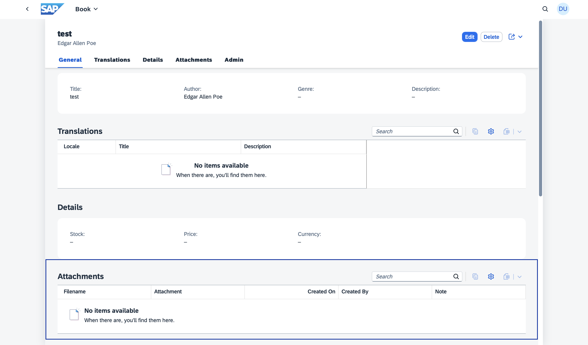
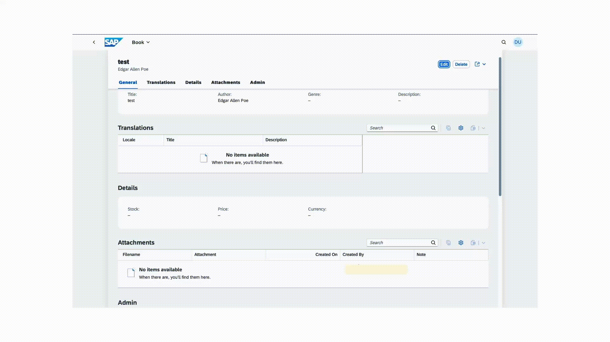
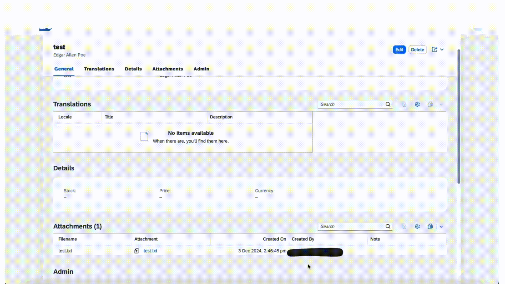
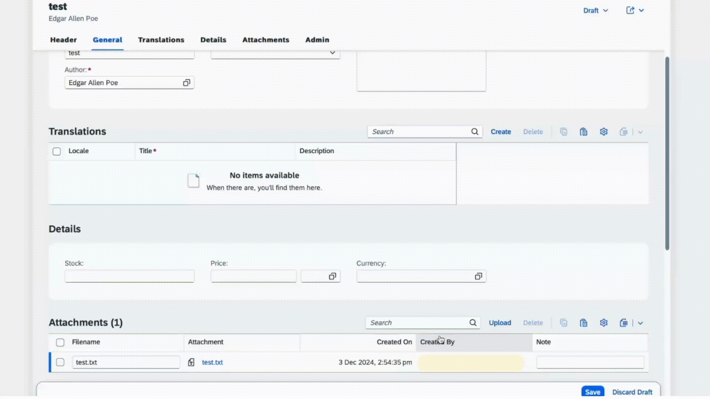
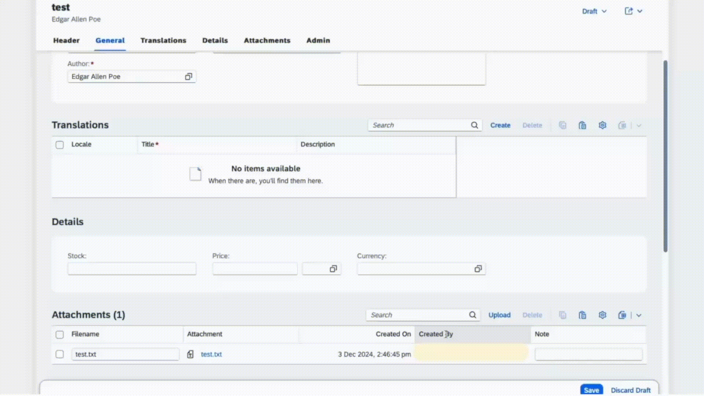

[](https://api.reuse.software/info/github.com/cap-java/sdm)

# CAP plugin for SAP Document Management Service
The `com.sap.cds:sdm` dependency is a [CAP Java plugin](https://cap.cloud.sap/docs/java/building-plugins) that provides an easy CAP-level integration with [SAP Document Management Service](https://discovery-center.cloud.sap/serviceCatalog/document-management-service-integration-option). This package supports handling of attachments(documents) by using an aspect Attachments in SAP Document Management Service.  
This plugin can be consumed by the CAP application deployed on BTP to store their documents in the form of attachments in Document Management Repository.

## Key features

- Create attachment : Provides the capability to upload new attachments.
- Read attachment : Provides the capability to preview attachments.
- Delete attachment : Provides the capability to remove attachments.
- Rename attachment : Provides the capability to rename attachments.
- Virus scanning : Provides the capability to support virus scan for virus scan enabled repositories.
- Draft functionality : Provides the capability of working with draft attachments.
- Display attachments specific to repository: Lists attachments contained in the repository that is configured with the CAP application.
- Custom properties : Provides the capability to define custom properties for attachments.
- Maximum allowed uploads: Provides the capability to define the maximum number of uploads allowed for the user.
- Multiple attachment facets: Provides the capability to define multiple attachment facets/sections in the CAP Entity.
- Technical user support: Provides the capability to consume the plugin using technical user.
- Copy attachments: Provides the capability to copy attachments from one entity to another entity.
- Link as attachments: Provides the capability to support link or URL as attachments.
- Edit Link-type attachments: Provides the capability to update URL of link-type attachments.
- Localization of error messages and UI fields: Provides the capability to have the UI fields and error messages translated to the local language of the leading application.
## Table of Contents

- [Pre-Requisites](#pre-requisites)
- [Setup](#setup)
- [Deploying and testing the application](#deploying-and-testing-the-application)
- [Use com.sap.cds:sdm dependency](#use-comsapcdssdm-dependency)
- [Support for Multitenancy](#support-for-multitenancy)
- [Support for Custom Properties](#support-for-custom-properties)
- [Support for Maximum allowed uploads](#support-for-maximum-allowed-uploads)
- [Support for Multiple attachment facets](#support-for-multiple-attachment-facets)
- [Support for Technical user](#support-for-technical-user)
- [Support for Copy attachments](#support-for-copy-attachments)
- [Support for Link type attachments](#support-for-link-type-attachments)
- [Support for Edit of Link type attachments](#support-for-edit-of-link-type-attachments)
- [Support for Localization](#support-for-localization)
- [Known Restrictions](#known-restrictions)
- [Support, Feedback, Contributing](#support-feedback-contributing)
- [Code of Conduct](#code-of-conduct)
- [Licensing](#licensing)

## Pre-Requisites
* Java 17 or higher
* [MTAR builder](https://www.npmjs.com/package/mbt) (`npm install -g mbt`)
* [Cloud Foundry CLI](https://docs.cloudfoundry.org/cf-cli/install-go-cli.html), Install cf-cli and run command `cf install-plugin multiapps`
* UI5 version 1.131.0 or higher

> **cds-services**
>
> The behaviour of clicking attachment and previewing it varies based on the version of cds-services used by the CAP application. 
>
> - For cds-services version >= 3.4.0, clicking on attachment will
>   - open the file in new browser tab, if browser supports the file type.
>   - download the file to the computer, if browser does not support the file type.
>
> - For cds-services version < 3.4.0, clicking on attachment will download the file to the computer
>
> A reference to adding this can be found [here](https://github.com/cap-java/sdm/blob/691c329f4c3c17ae390cfcb2db1ef02650585aee/cap-notebook/demoapp/pom.xml#L20)

## Setup

In this guide, we use the Bookshop sample app in the [deploy branch](https://github.com/cap-java/sdm/tree/deploy) of this repository, to integrate SDM CAP plugin.  Follow the steps in this section for a quick way to deploy and test the plugin without needing to create your own custom CAP application.

### Using the released version
If you want to use the version of SDM CAP plugin released on the central maven repository follow the below steps:

1. Remove the sdm and sdm-root folders from your local .m2 repository. This ensures that the CAP application uses the plugin version from the central Maven repository, as the local .m2 repository is prioritized during the build process.

2. Clone the sdm repository:

```sh
   git clone https://github.com/cap-java/sdm
```

3. Checkout to the branch **deploy**:

```sh
   git checkout deploy
```

4. Navigate to the demoapp folder:

```sh
   cd cap-notebook/demoapp
```

5. Configure the [REPOSITORY_ID](https://github.com/cap-java/sdm/blob/4180e501ecd792770174aa4972b06aff54ac139d/cap-notebook/demoapp/mta.yaml#L21) with the repository you want to use for deploying the application. Set the SDM instance name to match the SAP Document Management integration option instance you created in BTP and update this in the mta.yaml file under the [srv module](https://github.com/cap-java/sdm/blob/4180e501ecd792770174aa4972b06aff54ac139d/cap-notebook/demoapp/mta.yaml#L31) and the [resources section](https://github.com/cap-java/sdm/blob/4180e501ecd792770174aa4972b06aff54ac139d/cap-notebook/demoapp/mta.yaml#L98) values in the **mta.yaml**. 

6. Build the application:

```sh
   mbt build
```
Now the application will pick the released version of the plugin from the central maven repository as the dependency is added in the [pom.xml](https://github.com/cap-java/sdm/blob/4180e501ecd792770174aa4972b06aff54ac139d/cap-notebook/demoapp/srv/pom.xml#L18)

7. Log in to Cloud Foundry space:

```sh
   cf login -a <CF-API> -o <ORG-NAME> -s <SPACE-NAME>
```
8. Deploy the application:

```sh
   cf deploy mta_archives/*.mtar
```

### Using the development version
To use a development version of the SDM CAP plugin, follow these steps. This is useful if you want to test changes made in a separate branch of this github repository or use a version not yet released on the central Maven repository.

1. Clone the sdm repository:

```sh
   git clone https://github.com/cap-java/sdm
```
2. Install the plugin in the root folder after switiching to the branch you want to use:

```sh
   mvn clean install
```
The plugin is now added to your local .m2 repository, giving it priority over the version available in the central Maven repository during the application build.

3. Checkout to the branch **deploy**:

```sh
   git checkout deploy
```

4. Navigate to the demoapp folder:

```sh
   cd cap-notebook/demoapp
```

5. Configure the [REPOSITORY_ID](https://github.com/cap-java/sdm/blob/4180e501ecd792770174aa4972b06aff54ac139d/cap-notebook/demoapp/mta.yaml#L21) with the repository you want to use for deploying the application. Set the SDM instance name to match the SAP Document Management integration option instance you created in BTP and update this in the mta.yaml file under the [srv module](https://github.com/cap-java/sdm/blob/4180e501ecd792770174aa4972b06aff54ac139d/cap-notebook/demoapp/mta.yaml#L31) and the [resources section](https://github.com/cap-java/sdm/blob/4180e501ecd792770174aa4972b06aff54ac139d/cap-notebook/demoapp/mta.yaml#L98) values in the **mta.yaml**. 

6. Build the application:

```sh
   mbt build
```
7. Log in to Cloud Foundry space:

```sh
   cf login -a <CF-API> -o <ORG-NAME> -s <SPACE-NAME>
```
8. Deploy the application:

```sh
   cf deploy mta_archives/*.mtar
```

## Use com.sap.cds:sdm dependency
Follow these steps if you want to integrate the SDM CAP Plugin with your own CAP application. 

1. Add the following dependency in pom.xml in the srv folder
   
   ```xml
   <dependency>
      <groupId>com.sap.cds</groupId>
      <artifactId>sdm</artifactId>
      <version>{version}</version>
   </dependency>
   ```

   To be able to also use the cds models defined in this plugin the `cds-maven-plugin` needs to be used with the
   `resolve` goal to make the cds models available in the project:

   ```xml
   <plugin>
      <groupId>com.sap.cds</groupId>
      <artifactId>cds-maven-plugin</artifactId>
      <version>${cds.services.version}</version>
      <executions>
         <execution>
            <id>cds.resolve</id>
            <goals>
               <goal>resolve</goal>
            </goals>
         </execution>
      </executions>
   </plugin>
   ```

   If the cds models needs to be used in the `db` folder the `cds-maven-plugin` needs to be included also in the
   `db` folder of the project.
   This means the `db` folder needs to have a `pom.xml` with the `cds-maven-plugin` included and the `cds-maven-plugin`
   needs to be run.

   If the `cds-maven-plugin` is used correctly and executed the following lines should be visible in the build log:

   ````log
   [INFO] --- cds:3.4.1:resolve (cds.resolve) @ your-project ---
   [INFO] CdsResolveMojo: Extracting models from com.sap.cds:sdm:jar:<latest-version>:compile (<project-folder>)
   [INFO] CdsResolveMojo: Extracting models from com.sap.cds:cds-feature-attachments:jar:1.0.5:compile (<project-folder>)
   ````

   After that the models can be used.
   
2. To use sdm plugin in your CAP application, create an element with an `Attachments` type. Following the [best practice of separation of concerns](https://cap.cloud.sap/docs/guides/domain-modeling#separation-of-concerns), create a separate file _srv/attachment-extension.cds_ and extend your entity with attachments. Refer the following example from a sample Bookshop app:

   ```cds
   using {my.bookshop.Books } from '../db/books';
   using {sap.attachments.Attachments} from`com.sap.cds/sdm`;
   
   extend entity Books with {
      attachments : Composition of many Attachments;
   }
   ```

3. Create a SAP Document Management Integration Option [Service instance and key](https://help.sap.com/docs/document-management-service/sap-document-management-service/creating-service-instance-and-service-key). Bind your CAP application to this SDM instance. Add the details of this instance to the resources section in the `mta.yaml` of your CAP application. Refer the following example from a sample Bookshop app.

   ```yaml
   modules:
      - name: bookshop-srv
      type: java
      path: srv
      requires:
         - name: sdm-di-instance
  
   resources:
      - name: sdm-di-instance
      type: org.cloudfoundry.managed-service
      parameters:
         service: sdm
         service-plan: standard
   ```

4. Using the created SDM instance's credentials from key [onboard a repository](https://help.sap.com/docs/document-management-service/sap-document-management-service/onboarding-repository). In mta.yaml, under properties of the srv module add the repository id. Refer the following example from a sample Bookshop app. Currently only non versioned repositories are supported. 

    ```yaml
    modules:
      - name: bookshop-srv
      type: java
      path: srv
      properties:
            REPOSITORY_ID: <REPO ID>
      requires:
         - name: sdm-di-instance
    ```

5. To allow the application to upload large files, add the connection and request timeouts in mta.yaml under properties of srv and app module. Refer the following example from a sample Bookshop app.

   ```yaml
   modules:
      - name: bookshop-srv
      type: java
      path: srv
      properties:
            REPOSITORY_ID: <REPO ID>
            INCOMING_CONNECTION_TIMEOUT: 3600000
            INCOMING_REQUEST_TIMEOUT: 3600000
            INCOMING_SESSION_TIMEOUT: 3600000
            timeout: 3600000

      - name: demoappjava-app
        type: approuter.nodejs
        path: app
        properties:
            INCOMING_REQUEST_TIMEOUT: 3600000
            INCOMING_SESSION_TIMEOUT: 3600000
            INCOMING_CONNECTION_TIMEOUT: 3600000
        requires:
        - name: srv-api
         group: destinations
         properties:
            timeout: 3600000  
   ```

6. Add the following facet in _fiori-service.cds_ in the _app_ folder. Refer the following [example](https://github.com/cap-java/sdm/blob/16c1b17d521a141ef1b1adfbed1e06c5bf7a980f/cap-notebook/demoapp/app/admin-books/fiori-service.cds#L24) from a sample Bookshop app.

   ```cds
      {
         $Type : 'UI.ReferenceFacet',
         ID     : 'AttachmentsFacet',
         Label : '{i18n>attachments}',
         Target: 'attachments/@UI.LineItem'
      }
   ```

## Deploying and testing the application

1. Log in to Cloud Foundry space:

   ```sh
   cf login -a <CF-API> -o <ORG-NAME> -s <SPACE-NAME>
   ```

2. Build the project by running following command from root folder of your CAP application
   ```sh
   mbt build
   ```
   Above step will generate .mtar file inside mta_archives folder.

3. Deploy the application
   ```sh
   cf deploy mta_archives/*.mtar
   ```

4. Go to your BTP subaccount and launch your application.

5. The `Attachments` type has generated an out-of-the-box Attachments table (see highlighted box) at the bottom of the Object page:

   

6. **Upload a file** by going into Edit mode by using the **Upload** button on the Attachments table. The file is then stored in SAP Document Management Integration Option. We demonstrate this by uploading a TXT file:

   

7. **Open a file** by clicking on the attachment. We demonstrate this by opening the previously uploaded TXT file:

   

8. **Rename a file** by going into Edit mode and setting a new name for the file in the filename field. Then click the **Save** button to have that file renamed in SAP Document Management Integration Option. We demonstrate this by renaming the previously uploaded TXT file: 

   

9. **Delete a file** by going into Edit mode and selecting the file(s) and by using the **Delete** button on the Attachments table. Then click the **Save** button to have that file deleted from the resource (SAP Document Management Integration Option). We demonstrate this by deleting the previously uploaded TXT file:

   

## Support for Multitenancy

This plugin provides APIs for onboarding and offboarding of repositories for multitenant CAP SaaS applications. 

GetDependencies, subscribe and unsubscribe are the mandatory steps to be performed to support multitenancy.

Refer the below example to pass the SDM Service dependencies to SaaSRegistry so that SDM credentials are passed to subscribing tenant.
```java
//Set the SDM xsappname to SaaS Registry Dependency.
@On(event = DeploymentService.EVENT_DEPENDENCIES)
    public void onGetDependencies(DependenciesEventContext context) {

        List<SaasRegistryDependency> dependencies = new ArrayList<>();
        Map<String, Object> uaa = (Map<String, Object>) getSDMCredentials().get("uaa");
        dependencies.add(SaasRegistryDependency.create(uaa.get("xsappname").toString()));
        context.setResult(dependencies);
    }
    //Fetch the SDM service credentials
 private Map<String, Object> getSDMCredentials() {
    List<ServiceBinding> allServiceBindings =
    DefaultServiceBindingAccessor.getInstance().getServiceBindings();
ServiceBinding sdmBinding =
    allServiceBindings.stream()
        .filter(binding -> "sdm".equalsIgnoreCase(binding.getServiceName().orElse(null)))
        .findFirst()
        .get();
return  sdmBinding.getCredentials();

    }
 ```
Refer the below example where onboarding and offboarding APIs are used on tenant subscription and tenant unsubscription events of SaaS application.
  
```java
@After(event = DeploymentService.EVENT_SUBSCRIBE)
public void onSubscribe(SubscribeEventContext context) {
   final SaasRegistrySubscriptionOptions options = Struct
      .access(context.getOptions())
      .as(SaasRegistrySubscriptionOptions.class);
   final String subdomain = options.getSubscribedSubdomain();

   // Create repository instance and initialise params
   Repository repository = new Repository();
   repository.setDescription("Onboarding Repo Demo");
   repository.setDisplayName(" Test Onboarding repo");
   repository.setSubdomain(subdomain);
   repository.setHashAlgorithms("SHA-256");

   // Using SDMAdminServiceImpl onboardRepository() to onboard repository
   SDMAdminService sdmAdminService =  new SDMAdminServiceImpl();
   String response = sdmAdminService.onboardRepository(repository);
}
 ```
 ```java
 @After(event = DeploymentService.EVENT_UNSUBSCRIBE)
 public void afterUnsubscribe(UnsubscribeEventContext context) {
     //delete onboarded repository
         final SaasRegistrySubscriptionOptions options = Struct
        .access(context.getOptions())
        .as(SaasRegistrySubscriptionOptions.class);
 // Access the specific property
 final String subdomain = options.getSubscribedSubdomain();
 
 SDMAdminService sdmAdminService =  new SDMAdminServiceImpl();
 String res = sdmAdminService.offboardRepository(subdomain);
 }
 ```

> **Note**
>
> Unsubscription will fail if an error occurs while deleting the repository, except when the error indicates that the repository was not found — in that case, the unsubscription will succeed.

When the application is deployed as a SaaS application with above code, a repository is onboarded automatically when a tenant subscribes the SaaS application. The same repository is deleted when the tenant unsubscribes from the SaaS application.
The necessary params for the Repository onboarding can be found in the [documentation](https://help.sap.com/docs/document-management-service/sap-document-management-service/internal-repository).

## Support for Custom Properties

Custom properties are supported via the usage of CMIS secondary type properties. Follow the below steps to add and use custom properties.

1. If the repository does not contain secondary types and properties, create CMIS secondary types and properties using the [Create Secondary Type API](https://api.sap.com/api/CreateSecondaryTypeApi/overview). The property definition must contain the following section for the CAP plugin to process the property.

   ```json
   "mcm:miscellaneous": {        
      "isPartOfTable": "true"  
   } 
   ```

   With this, the secondary type and properties definition will be as per the sample given below

      ```json
      {
         "id": "Working:DocumentInfo",
         "displayName": "Document Info",
         "baseId": "cmis:secondary",
         "parentId": "cmis:secondary",
         ...
         },
         "propertyDefinitions": {
            "Working:DocumentInfoRecord": {
                  "id": "Working:DocumentInfoRecord",
                  "displayName": "Document Info Record",
                  ...
                  "mcm:miscellaneous": {     <-- Required section in the property definition
                     "isPartOfTable": "true"
                  }
            }
         }
      }
      ```

2. Using secondary properties in CAP Application.
   - Extend the `Attachments` aspect with the secondary properties in the previously created _attachment-extension.cds_ file. 
   - Annotate the secondary properties with `@SDM.Attachments.AdditionalProperty.name`. 
   - In this field set the name of the secondary property in SDM. 
   
   Refer the following example from a sample Bookshop app:

      ```cds
      extend Attachments with {
         customProperty : String
            @SDM.Attachments.AdditionalProperty: {
               name: 'Working:DocumentInfoRecordString'
            }  
            @(title: 'DocumentInfoRecordString');
      }
      ```

   > **Note**
   >
   > SDM supports secondary properties with data types `String`, `Boolean`, `Decimal`, `Integer` and `DateTime`.  

## Support for Maximum allowed uploads
This plugin allows you to customize the maximum number of uploads a user can perform. Once a user exceeds the defined limit, any further upload attempts will trigger an error. The error message shown to the user is also fully customizable. The annotation `@SDM.Attachments` should be used for defining the maximum upload limit and the error message.

Refer the following example from a sample Bookshop app:
-  maxCount: Specifies the maximum number of documents a user is allowed to upload.
-  maxCountError: Defines the error message displayed when the upload limit (maxCount) is exceeded.

```cds
  extend entity Books with {
    attachments : Composition of many Attachments @SDM.Attachments:{maxCount: 4, maxCountError:'Only 4 attachments allowed.'};
    }
   
   ``` 
   > **Note**
   >
   > Once the maxCount is configured, it is recommended not to alter it. If the maxCount is altered, the previously uploaded documents will still be visible.

## Support for Multiple attachment facets
The plugin supports creating multiple attachment facets or sections, each allowing various documents to be uploaded. The names of these facets are fully customizable. All existing operations available for the default attachment facet are also supported for any additional facets you create.

Refer the following example from a sample Bookshop app,

- attachments: Will create a section named attachments on UI.
- references: Will create a section named references on UI.
- footnotes: Will create a section named footnotes on UI.
```cds
   extend entity Books with {
    attachments : Composition of many Attachments;
    references : Composition of many Attachments;
    footnotes : Composition of many Attachments;
}
```
Add the following facet in _fiori-service.cds_ in the _app_ folder. Refer the following [example](https://github.com/cap-java/sdm/blob/develop_deploy/cap-notebook/demoapp/app/admin-books/fiori-service.cds) from a sample Bookshop app.
```cds
{
      $Type : 'UI.ReferenceFacet',
      ID    : 'AttachmentsFacet',
      Label : '{i18n>attachments}',
      Target: 'attachments/@UI.LineItem'
    },
    {
      $Type : 'UI.ReferenceFacet',
      ID    : 'ReferencesFacet',
      Label : 'References',
      Target: 'references/@UI.LineItem'
    },
    {
      $Type : 'UI.ReferenceFacet',
      ID    : 'FootnotesFacet',
      Label : 'Footnotes',
      Target: 'footnotes/@UI.LineItem'
    }
    
  ``` 
   > **Note**
   >
   > Once a facet or section name is defined in the CDS file, it is strongly recommended not to modify it. For instance, in the example provided, section names such as attachments, references, and footnotes should remain unchanged after initial configuration. Renaming these sections will result in the creation of new tables, causing any data associated with the original sections to become inaccessible in the UI.

## Support for technical user
The CAP OData operations can be performed on attachments using a technical user. This flow can be used for machine-to-machine (M2M) interactions, where user involvement is not necessary.

A leading CAP application's service should add the requires with annotation "system-user". For more detailed information on "system-user" within the SAP CAP framework, refer to the [Capire documentation](https://cap.cloud.sap/docs/guides/security/authorization#pseudo-roles). Here is an [example](https://github.com/cap-java/sdm/blob/develop_deploy/cap-notebook/demoapp/srv/admin-service.cds) from a sample Bookshop app demonstrating the implementation.
```cds
service AdminService @(requires: ['admin', 'system-user'])
```

The plugin supports technical users using oAuth 2.0 client credentials flow. Refer the following [example](https://github.com/cap-java/sdm/blob/a1bd1a0d829e6f25e4db349143b621757e0274d1/sdm/src/test/java/integration/com/sap/cds/sdm/IntegrationTest_SingleFacet.java#L80) of an OData call.
```java
request =
   new Request.Builder()
      .url(authUrl + "/oauth/token?grant_type=client_credentials")
      .method("POST", body)
      .addHeader("Authorization", basicAuth)
      .build();
```

## Support for copy attachments

This plugin provides capability to copy attachments from one entity to another. This capability will copy attachments metadata on CAP as well as actual content on the SAP Document Management service repository. This feature can be used in following two ways.

1. **A helper method to copy attachments from one entity to another**
   
   The `AttachmentService` instance can be used to call `copyAttachments` method. This method expects an object of `CopyAttachmentInput` which requires new entity's Id (`up__Id`), the `attachments facet name` and the `list of objectIds` corresponding to attachments that are to be copied.

   Example usage:
   ```java
      String up__ID = "123";
      List<String> objectIds = ["abc", "xyz"];
      String facet = "AdminService.Books.attachments" // Target facet. This can be usually obtained from context.getTarget().getQualifiedName()
      boolean isSystemUser = false;
      var copyEventInput =
         new CopyAttachmentInput(up__ID, facet, objectIds);
      attachmentService.copyAttachments(copyEventInput, isSystemUser);
   ```
2. **OData API to copy attachments from one entity to another**
   
   You can also use an OData API call to trigger the copy operation.
   `AttachmentsService` endpoint URL can be used with suffix `/<Service_name>.copyAttachments` . This request expects the following request body:
   ```json
   {
      "up__ID" : "<up__ID>",  // ID of the new entity
      "objectIds" : "abc","xyz" // objectIds corresponding to attachments that are to be copied
   }
   ```

   Example usage:  
   ```
   HTTP Method: POST
   Request URL:
   <app_url>/odata/v4/<Service_Name>/<Entity_Name>(ID=<up__ID>,IsActiveEntity=false)/attachments/<Service_name>.copyAttachments
   Request Body:
   {
      "up__ID": "<up__ID>",
      "objectIds": "abc","xyz"
   }
   ```

## Support for link type attachments

> **Note:** Row-press is the new recommended approach for handling actions on attachment rows. With row-press enabled, the Attachments column will no longer appear as a separate action button. Instead, clicking on a row will automatically perform the appropriate action — opening a link or downloading a file, based on the attachment type.

This plugin provides the capability to create, open, rename and delete attachments of link type.

### Steps to Enable Row-Press for Open Link

1. **Add the `openAttachment` action to application's service definition**
   
   See this [example](https://github.com/cap-java/sdm/blob/90cfc716967d844e114457a710daebdd55431965/cap-notebook/demoapp/srv/admin-service.cds#L19) from a sample Bookshop app.

   ```cds
   action openAttachment() returns String;
   ```

2. **Add a custom controller extension** 

   In webapp/controller/custom.controller.js, copy and paste below content.
   
   See this [example](https://github.com/cap-java/sdm/blob/develop_deploy/cap-notebook/demoapp/app/admin-books/webapp/controller/custom.controller.js) from a sample Bookshop app.
   
   ```js
   sap.ui.define(
      [
      "sap/ui/core/mvc/ControllerExtension",
      "sap/m/library"
      ], 
      function (ControllerExtension,library) {
         "use strict";
      
         return ControllerExtension.extend("books.controller.custom", {
               onRowPress: function(oContext) {
                  this.base.editFlow
                  .invokeAction("AdminService.openAttachment", {
                     contexts: oContext.getParameter("bindingContext")
                  })
                  .then(function (res) {
                     let odataurl = "";
                     if(res.getObject().value == "None") {
                           const lastSlashIndex = res.oModel.getServiceUrl().lastIndexOf('/');
                           let str = res.oModel.getServiceUrl();
                           if (lastSlashIndex !== -1) {
                              str = str.substring(0, lastSlashIndex)  + str.substring(lastSlashIndex + 1);
                           }
                           odataurl = str+res.oBinding.oContext.sPath+"/content";
                     } else {
                           odataurl = res.getObject().value;
                     }
                     library.URLHelper.redirect(odataurl, true);
                              
                  });
               }
         });
      }
   );
   ```
   
   - Replace `books` in `ControllerExtension.extend` with the `SAPUI5.Component` name from your `app/appconfig/fioriSandboxConfig.json` file. See this [example](https://github.com/cap-java/sdm/blob/90cfc716967d844e114457a710daebdd55431965/cap-notebook/demoapp/app/appconfig/fioriSandboxConfig.json#L86).
   - Replace `AdminService` in `invokeAction("AdminService.openAttachment")` with the name of your service.

3. **Add controlConfiguration for Row Press**

   In your `sap.ui5.routing.targets` section, under the relevant Object Page (e.g., `BooksDetails`), add or extend the `controlConfiguration` for the facet you want to enhance by copy and pasting below content. See this [example](https://github.com/cap-java/sdm/blob/90cfc716967d844e114457a710daebdd55431965/cap-notebook/demoapp/app/admin-books/webapp/manifest.json#L121)

   ```json
   "controlConfiguration": {
      "attachments/@com.sap.vocabularies.UI.v1.LineItem": {
         "tableSettings": {
            "type": "ResponsiveTable",
            "selectionMode": "Auto",
            "rowPress": ".extension.books.controller.custom.onRowPress"
         }
      }
   }
   ```
   - Replace `attachments` with your entity’s facet name as needed.
   - Repeat for other facets's if required.
   - Replace `books` in `"rowPress": ".extension.books.controller.custom.onRowPress"` with the SAPUI5.Component name from your 
   `app/appconfig/fioriSandboxConfig.json` file. Refer this [example](https://github.com/cap-java/sdm/blob/90cfc716967d844e114457a710daebdd55431965/cap-notebook/demoapp/app/appconfig/fioriSandboxConfig.json#L86) from a sample Bookshop app.

4. **Register the Custom Controller Extension**
   
   In the root of your `sap.ui5` section, add or extend the `extends` property to register your custom controller by copy and pasting below content. See this [example](https://github.com/cap-java/sdm/blob/90cfc716967d844e114457a710daebdd55431965/cap-notebook/demoapp/app/admin-books/webapp/manifest.json#L159)

   ```json
   "extends": {
      "extensions": {
         "sap.ui.controllerExtensions": {
            "sap.fe.templates.ObjectPage.ObjectPageController#books::BooksDetailsList": {
            "controllerName": "books.controller.custom"
            }
         }
      }
   }
   ```
   - Replace `books` in `"sap.fe.templates.ObjectPage.ObjectPageController#books::BooksDetailsList"` with the SAPUI5.Component name from your 
   `app/appconfig/fioriSandboxConfig.json` file. Refer this [example](https://github.com/cap-java/sdm/blob/90cfc716967d844e114457a710daebdd55431965/cap-notebook/demoapp/app/appconfig/fioriSandboxConfig.json#L86) from a sample Bookshop app.
   - Replace `BooksDetailsList` in `"sap.fe.templates.ObjectPage.ObjectPageController#books::BooksDetailsList"` with id of the relevant Object Page (e.g., BooksDetails). Refer this [example](https://github.com/cap-java/sdm/blob/90cfc716967d844e114457a710daebdd55431965/cap-notebook/demoapp/app/admin-books/webapp/manifest.json#L109) from a sample Bookshop app.
   - Replace `books` in `"controllerName": "books.controller.custom"` with the SAPUI5.Component name from your 
   `app/appconfig/fioriSandboxConfig.json` file. Refer this [example](https://github.com/cap-java/sdm/blob/90cfc716967d844e114457a710daebdd55431965/cap-notebook/demoapp/app/appconfig/fioriSandboxConfig.json#L86) from a sample Bookshop app.

### Steps to Enable Create Link Feature in CAP Application

> **Note:** Enabling row-press for open link (see steps above) is a prerequisite for link support.

1. **Add the `createLink` action to application's service definition** 
   
   See this [example](https://github.com/cap-java/sdm/blob/90cfc716967d844e114457a710daebdd55431965/cap-notebook/demoapp/srv/admin-service.cds#L12) from a sample Bookshop app:

   ```cds
   action createLink(
         in:many $self,
         @mandatory @Common.Label:'Name' name: String @UI.Placeholder: 'Enter a name for the link',
         @mandatory @assert.format:'^(https?:\/\/)(([a-zA-Z0-9\-]+\.)+[a-zA-Z]{2,}|localhost)(:\d{2,5})?(\/[^\s]*)?$'
         @Common.Label:'URL' url: String @UI.Placeholder: 'Example: https://www.example.com'
      ); 
   ```
   - Purpose: Enables users to create links with name and URL.
   - Validation: Ensures only valid HTTP(S) URLs are accepted.
   - UI Support: Provides labels and placeholders for better user experience.

### UI Annotation Setup

To enable the creation of links, you need to add a new button to the attachments table toolbar. This button will appear as a **menu button labeled "Create"** on the toolbar of the attachments table. When clicked, it will display a menu with the **"Link"** option, allowing users to create a new link-type attachment.

Add the following annotation block to your app/common.cds file. See this [example](https://github.com/cap-java/sdm/blob/4288ce6f58bc415a171a9e0340fa075aeac835ff/cap-notebook/demoapp/app/common.cds#L60)

```cds
annotate my.Books.attachments with @UI: {
  HeaderInfo: {
    $Type         : 'UI.HeaderInfoType',
    TypeName      : '{i18n>Attachment}',
    TypeNamePlural: '{i18n>Attachments}',
  },
  LineItem  : [
    {Value: type, @HTML5.CssDefaults: {width: '10%'}},
    {Value: fileName, @HTML5.CssDefaults: {width: '25%'}},
    {Value: content, @HTML5.CssDefaults: {width: '0%'}},
    {Value: createdAt, @HTML5.CssDefaults: {width: '20%'}},
    {Value: createdBy, @HTML5.CssDefaults: {width: '20%'}},
    {Value: note, @HTML5.CssDefaults: {width: '25%'}},
    {
      $Type  : 'UI.DataFieldForActionGroup',
      ID     : 'TableActionGroup',
      Label  : 'Create',
      ![@UI.Hidden]: {$edmJson: {$Eq: [ {$Path: 'IsActiveEntity'}, true ]}},
      Actions: [
        {
          $Type : 'UI.DataFieldForAction',
          Label : 'Link',
          Action: 'AdminService.createLink',
        }
      ]
    },
  ],
} 
{
  note       @(title: '{i18n>Note}');
  type       @(title: '{i18n>Type}');
  linkUrl       @(title: '{i18n>LinkURL}');
  fileName  @(title: '{i18n>Filename}');
  modifiedAt @(odata.etag: null);
  content
    @Core.ContentDisposition: { Filename: fileName }
    @(title: '{i18n>Attachment}');
  folderId @UI.Hidden;
  repositoryId  @UI.Hidden ;
  objectId  @UI.Hidden ;
  mimeType @UI.Hidden;
  status @UI.Hidden;
}
annotate Attachments with @Common: {SideEffects #ContentChanged: {
  SourceProperties: [content],
  TargetProperties: ['status'],
  TargetEntities : [Books.attachments]
}}{};
```

- Replace `my.Books.attachments` with the correct path for your entity and element (for example, `my.YourEntity.yourElement`) where you have defined `composition of many Attachments`.
- Replace `AdminService` in `Action: 'AdminService.createLink'` with the name of your service.
- Repeat for other entities and elements if you have defined multiple `composition of many Attachments`.

### Updating Tenant Databases for Link Feature
To support the Link feature, additional database columns are introduced.
Upon re-deployment of your multitenant application, you may encounter "invalid column" errors if tenant database containers are not updated.

To resolve this, ensure the following hook command is added to the mta.yaml for the sidecar application.
```
hooks:
- name: upgrade-all
type: task
phases:
- blue-green.application.before-start.idle
- deploy.application.before-start
parameters:
name: upgrade
memory: 512M
disk-quota: 768M
command: npx -p @sap/cds-mtx cds-mtx upgrade "*"
```
This will automatically update tenant databases during deployment. See this [example](https://github.com/vibhutikumar07/cloud-cap-samples-java/blob/31009de404af0ddc92b8c593b21395757ed053e6/mta.yaml#L71).

## Support for edit of link type attachments

This plugin provides the capability to update/edit the URL of attachments of link type.

### Steps to Enable Edit Link Feature in CAP Application

1. **Add the `editLink` action to application's service definition** 
   
   See this [example](https://github.com/cap-java/sdm/blob/a1fc26f3aa92ffd4f9203d815f51107838d5f677/cap-notebook/demoapp/srv/admin-service.cds#L18) from a sample Bookshop app:

   ```cds
   action editLink(
         @mandatory @assert.format:'^(https?:\/\/)(([a-zA-Z0-9\-]+\.)+[a-zA-Z]{2,}|localhost)(:\d{2,5})?(\/[^\s]*)?$'
         @Common.Label:'URL' url: String @UI.Placeholder: 'Example: https://www.example.com'
      ); 
   ```
   - Purpose: Enables users to edit URL of previously created links.
   - Validation: Ensures only valid HTTP(S) URLs are accepted.
   - UI Support: Provides labels and placeholders for better user experience.

### UI Annotation Setup

To enable the editing of links, you need to add a new button to the attachments table toolbar. This button will appear as an **inline button labeled "Edit Link"** on the attachment row of the attachments table for only link type attachments. When clicked, it will display a menu with the **"Edit Link"** option, allowing users to edit the URL of an existing link-type attachment.

Add the following annotation block to your app/common.cds file. See this [example](https://github.com/cap-java/sdm/blob/4288ce6f58bc415a171a9e0340fa075aeac835ff/cap-notebook/demoapp/app/common.cds#L60)

```cds
annotate my.Books.attachments with @UI: {
  HeaderInfo: {
    $Type         : 'UI.HeaderInfoType',
    TypeName      : '{i18n>Attachment}',
    TypeNamePlural: '{i18n>Attachments}',
  },
  LineItem  : [
    {Value: type, @HTML5.CssDefaults: {width: '10%'}},
    {Value: fileName, @HTML5.CssDefaults: {width: '25%'}},
    {Value: content, @HTML5.CssDefaults: {width: '0%'}},
    {Value: createdAt, @HTML5.CssDefaults: {width: '20%'}},
    {Value: createdBy, @HTML5.CssDefaults: {width: '20%'}},
    {Value: note, @HTML5.CssDefaults: {width: '25%'}},
    {
      $Type  : 'UI.DataFieldForActionGroup',
      ID     : 'TableActionGroup',
      Label  : 'Create',
      ![@UI.Hidden]: {$edmJson: {$Eq: [ {$Path: 'IsActiveEntity'}, true ]}},
      Actions: [
        {
          $Type : 'UI.DataFieldForAction',
          Label : 'Link',
          Action: 'AdminService.createLink',
        }
      ]
    },
    {
      @UI.Hidden: {$edmJson:{$If:[{$Eq:[{$Path: 'IsActiveEntity' },true]},true,{$If:[{$Ne:[{$Path:'mimeType'},'application/internet-shortcut']},true,false]}]}},
      $Type : 'UI.DataFieldForAction',
      Label : 'Edit Link',
      Action: 'AdminService.editLink',
      Inline: true,
      IconUrl: 'sap-icon://edit',
      @HTML5.CssDefaults: {width: '4%'}        
    }
  ],
} 
{
  note       @(title: '{i18n>Note}');
  type       @(title: '{i18n>Type}');
  linkUrl       @(title: '{i18n>LinkURL}');
  fileName  @(title: '{i18n>Filename}');
  modifiedAt @(odata.etag: null);
  content
    @Core.ContentDisposition: { Filename: fileName }
    @(title: '{i18n>Attachment}');
  folderId @UI.Hidden;
  repositoryId  @UI.Hidden ;
  objectId  @UI.Hidden ;
  mimeType @UI.Hidden;
  status @UI.Hidden;
}
annotate Attachments with @Common: {SideEffects #ContentChanged: {
  SourceProperties: [content],
  TargetProperties: ['status'],
  TargetEntities : [Books.attachments]
}}{};
```

- Replace `my.Books.attachments` with the correct path for your entity and element (for example, `my.YourEntity.yourElement`) where you have defined `composition of many Attachments`.
- Replace `AdminService` in `Action: 'AdminService.editLink'` with the name of your service.
- Repeat for other entities and elements if you have defined multiple `composition of many Attachments`.

## Support for Localization
If the UI fields have to be available in the local language of the leading application ensure to add the below fields in the i18n_[languagecode].properties file under app/_i18n folder.
Default language translations are present in i18n.properties files. If leading application does not provide any keys and values in their language properties files then default english language messages are shown to the user.

Example i18n_de.properties for german language.
```
Attachment=Attachment
Attachments=Attachments
Note= Attachment Note
Filename=File Name
linkUrl=Link Url
type=Type
 ```
For the exception messages as well the translation be provided by adding the translation to messages_[languagecode].properties files present under srv/src/main/resources.
Default language translations are present in messages.properties. If leading application does not provide any keys and values in their language properties files then default english language messages are shown to the user.

Example for german language
```
SDM.Attachments.maxCountError = Maximum number of attachments reached in German......
 ```
## Known Restrictions

- UI5 Version 1.135.0: This version causes error in upload of attachments.
- Repository : This plugin does not support the use of versioned repositories.
- File size : If the repository is [onboarded](https://help.sap.com/docs/document-management-service/sap-document-management-service/internal-repository?version=Cloud&locale=en-US) with virus scanning, only attachments upto 400 MB will be scanned for virus. 
- Datatypes for custom properties : Custom properties are supported for the following data types `String`, `Boolean`, `Decimal`, `Integer` and `DateTime`.  

## Support, Feedback, Contributing

This project is open to feature requests/suggestions, bug reports etc. via [GitHub issues](https://github.com/cap-java/sdm/issues). Contribution and feedback are encouraged and always welcome. For more information about how to contribute, the project structure, as well as additional contribution information, see our [Contribution Guidelines](CONTRIBUTING.md).

## Code of Conduct

We as members, contributors, and leaders pledge to make participation in our community a harassment-free experience for everyone. By participating in this project, you agree to abide by its [Code of Conduct](CODE_OF_CONDUCT.md) at all times.

## Licensing

Copyright 2024 SAP SE or an SAP affiliate company and <your-project> contributors. Please see our [LICENSE](LICENSE) for copyright and license information. Detailed information including third-party components and their licensing/copyright information is available [via the REUSE tool](https://api.reuse.software/info/github.com/cap-java/sdm).

